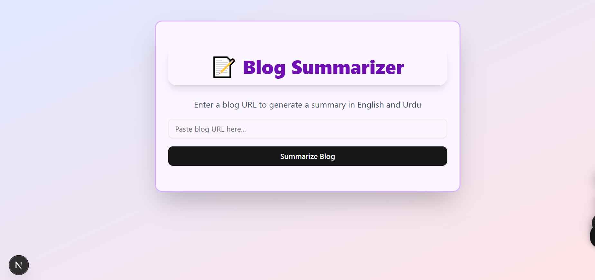
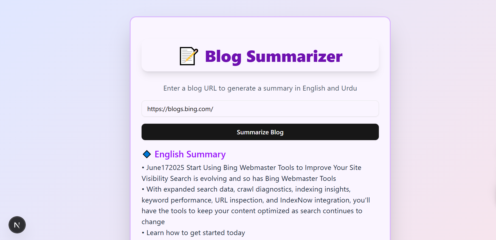
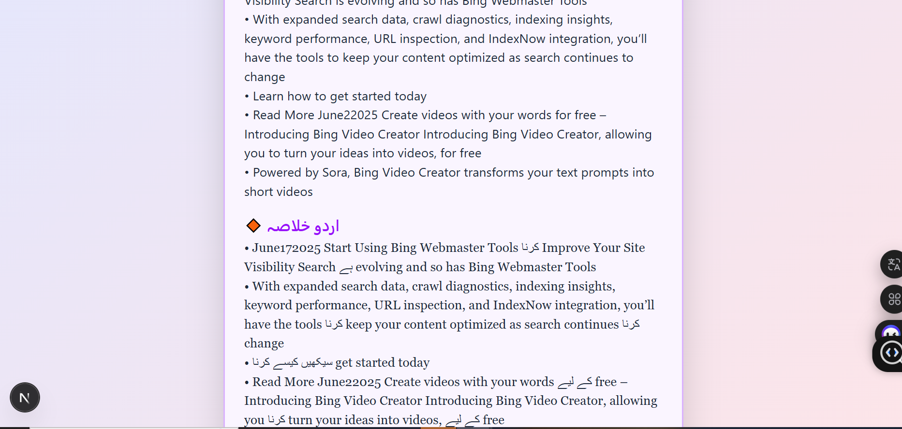
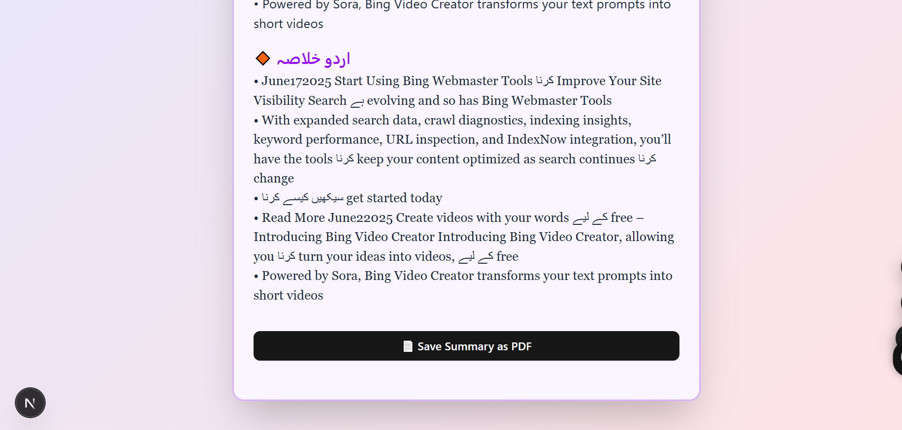

# 📝 Blog Summarizer

A full-stack web app that extracts content from blogs, summarizes it in English, translates the summary to Urdu, and allows exporting the Urdu summary to PDF. Built using **Next.js**, **Supabase**, **MongoDB**, and **ShadCN UI**.

🔗 **Live Site**:  
👉 [View Deployed App on Vercel](https://nexium-fatima-farrukh-rana-bl-git-db4dad-fatimarana50s-projects.vercel.app)

---

## 📸 Screenshots

### 1. Homepage



---

### 2. English and Urdu Summary Display



---

### 3. Urdu Summary Section



---

### 4. Export to PDF Button



---

## ⚙️ Tech Stack

- **Framework**: Next.js (App Router)
- **Styling**: Tailwind CSS + ShadCN UI
- **Database**: Supabase (Postgres), MongoDB Atlas
- **APIs**: Axios, Cheerio for scraping
- **Deployment**: Vercel

---

## 📁 Local Setup

```bash
git clone https://github.com/yourusername/assignment-2.git
cd assignment-2
npm install
npm run dev
Make sure to create a .env.local file and add the required keys:

env
Copy
Edit
SUPABASE_URL=your_supabase_url
SUPABASE_ANON_KEY=your_anon_key
MONGODB_URI=your_mongodb_uri
MONGODB_DB_NAME=your_db_name
```
👩‍💻 Developed by
Fatima Rana
GitHub:https://github.com/FatimaRana50 • LinkedIn:https://www.linkedin.com/in/fatima-farrukh-rana-ba23bb30b/
